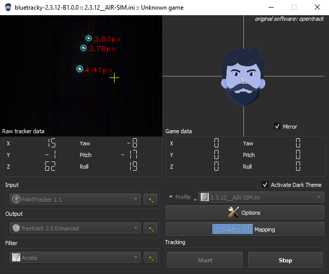

# Bluetracky

`Bluetracky` is a custom edited build of `opentrack version 2.3.12` with a focus on the `Point Tracker` module. It takes opentrack 2.3.12 and adds hand-picked quality of life modification seen on later builds. Tracking efficiency of the Point Tracker found on opentrack 2.3.12 is not altered. Additionally, it also contains custom additions not found in the original software (at the time this custom build was made).

This is mostly a personal build tailored to my own needs which I make available to anyone interested in it. My motivation on this project is explained below.

## Motivation

This endeavor to create a custom build is a result of tackling problems faced with the original software. The software was working well with my personal made profile I spent countless hours fine-tuning until a later version of the software made my profile not work so well anymore. The head tracking got really bad and was not as much stable as it used to be despite tweaking new available features (positive results were found, but they never matched my previous experience).

At this point, I knew for sure the build v2.3.12 was the last one I knew to be working exactly as I expected to. However, this build is lacking some features I'd like to have. The most predominant ones are the dark theme and the fix to the PS3 red light not shutting down on the PS3 open driver.

Following the mantra of `if it ain't broke, don't fix it`, I decided to take the 2.3.12 build and polish the outside to my liking. From the get-go this new custom build was designed to not alter any tracking efficiency found in 2.3.12 and just apply necessary fixes (e.g. PS3 red light) and end-user (GUI) additions. Also remember this is tailored to my own needs so my focus was mainly on the Point Tracker module, I didn't chase fixes for other tracking solutions.

## Notable changes
Some of these changes come from later builds of opentrack and others are my personal additions:
- Dark theme: available as a toggle (instead of being locked to your OS system theme).
- PS3 red light: fix the light not shutting down when the software is stopped.
- Octopus head became a human head.
- Enhanced human head position and lighting.
- Add a mirror option for the human head position to mimic result as seen in-game. Made this option selected by default.
- Default folder used for saving profiles changed in order to not conflict with the original opentrack software.

## Settings location
In order to not mix-match and conflict with the original opentrack, bluetracky stores its settings in a different location in your registry and in your storage.

Profiles are stored in the following folder: `%USERPROFILE%/Documents/bluetracky`.

## Note on the software name
I decided to give this custom build the name bluetracky instead of opentrack in the hope to not confuse people while using either of these softwares. It will be clear whether you're using an official opentrack software or not.

Additionally, for the fun of it and because it helps make further distinction, I also changed the logo to my liking.

*Side note for devs: the name is mostly changed for the end user (interface, executable). Internally, references  (e.g. variable names) are kept to 'opentrack'.*

## Release platform
Currently Windows is the targeted platform for release builds. You'll need to build it yourself for other platforms with no guarantee as I've presently not tested its effectiveness.

## Logo credit
The logo is a custom design based on these free resources:

- Head / Hairs
[Designed by pikisuperstar / Freepik](https://www.freepik.com/free-vector/cartoon-man-character-template_4175440.htm)
- Eyes / Nose
[Designed by brgfx / Freepik](https://www.freepik.com/free-vector/faceless-man-different-faces-with-emotions_1250774.htm)
- Beard
[Designed by macrovector / Freepik](https://www.freepik.com/free-vector/beard-hairstyles-face-set_3799705.htm)

## Full Credits
I would like to personally thank the creator of opentrack and his contributors for making opentrack a great open source tool.

The complete original credits is found at the [README below](#credits-in-chronological-order).

***

# Original README below! (opentrack readme)

## Intro

opentrack project home is located at <<http://github.com/opentrack/opentrack>>.

For the latest **downloads** visit <<https://github.com/opentrack/opentrack/releases>> Download an `.exe` installer or a `.7z` archive. Currently installers and portable versions for Windows are available for each release. It supports [USB stick truly "portable" installations](https://github.com/opentrack/opentrack/wiki/portable-mode-for-USB-sticks)

Please first refer to <<https://github.com/opentrack/opentrack/wiki>>
for [new user guide](https://github.com/opentrack/opentrack/wiki/Quick-Start-Guide-(WIP)), [frequent answers](https://github.com/opentrack/opentrack/wiki/common-issues), specific tracker/filter
documentation. See also the [gameplay video](https://www.youtube.com/watch?v=XI73ul_FnBI) with opentrack set up.

## Looking for railway planning software?

**Railway planning software** <<http://opentrack.ch>> had the name `opentrack` first. Apologies for the long-standing naming conflict.

## Usage

`opentrack` is an application dedicated to tracking user's head
movements and relaying the information to games and flight simulation
software.

`opentrack` allows for output shaping, filtering, and operating with many input and output devices and protocols; the codebase runs Microsoft Windows, Apple OSX (currently unmaintained), and GNU/Linux.

Don't be afraid to submit an **issue/feature request** if you have any problems! We're a friendly bunch.

## Tracking input

- PointTracker by Patrick Ruoff, freetrack-like light sources
- Oculus Rift DK1, DK2, CV, and legacy/knockoff versions (Windows only)
- Paper [marker support](https://github.com/opentrack/opentrack/wiki/Aruco-tracker)
  via the ArUco library <<https://github.com/opentrack/aruco>>
- Razer Hydra
- Relaying via UDP from a different computer
- Relaying UDP via FreePIE-specific Android app
- Joystick analog axes (Windows)
- Windows Phone [tracker](https://github.com/ZanderAdam/OpenTrack.WindowsPhone/wiki) over opentrack UDP protocol
- Arduino with custom firmware
- Intel RealSense 3D cameras (Windows)
- BBC micro:bit, LEGO, sensortag support via Smalltalk[(1)](https://en.wikipedia.org/wiki/Smalltalk)[(2)](https://en.wikipedia.org/wiki/Alan_Kay)
  [S2Bot](http://www.picaxe.com/Teaching/Other-Software/Scratch-Helper-Apps/)
- Wiimote (Windows)

## Output protocols

- SimConnect for newer Microsoft Flight Simulator (Windows)
- freetrack implementation (Windows)
- Relaying UDP to another computer
- Virtual joystick output (Windows, Linux, OSX)
- Wine freetrack glue protocol (Linux, OSX)
- X-Plane plugin (Linux)
- Tablet-like mouse output (Windows)
- FlightGear
- FSUIPC for Microsoft Flight Simulator 2002/2004 (Windows)
- SteamVR through a bridge (Windows; see <<https://github.com/r57zone/OpenVR-OpenTrack>> by @r57zone)

## Credits, in chronological order

- Stanisław Halik (maintainer)
- Wim Vriend -- author of [FaceTrackNoIR](http://facetracknoir.sourceforge.net/) that served as the initial codebase for `opentrack`. While the  code was almost entirely rewritten, we still hold on to many of `FaceTrackNoIR`'s ideas.
- Chris Thompson (aka mm0zct, Rift and Razer Hydra author and maintainer)
- Patrick Ruoff (PT tracker author)
- Xavier Hallade (Intel RealSense tracker author and maintainer)
- furax49 (hatire tracker author)
- Michael Welter (contributor)
- Alexander Orokhovatskiy (Russian translation; profile repository maintenance; providing hardware; translating reports from the Russian community)
- Attila Csipa (Micro:Bit author)
- Eike "e4z9" (OSX joystick output driver)
- Wei Shuai (Wiimote tracker)
- Stéphane Lenclud (Kinect Face Tracker, Easy Tracker)

## Thanks

- uglyDwarf (high CON)
- Andrzej Czarnowski (FreePIE tracker and
  [Google Cardboard](https://github.com/opentrack/opentrack/wiki/VR-HMD-goggles-setup-----google-cardboard,-colorcross,-opendive)
  assistance, testing)
- Wim Vriend (original codebase author and maintainer)
- Ryan Spicer (OSX tester, contributor)
- Ries van Twisk (OSX tester, OSX Build Fixes, contributor)
- Donovan Baarda (filtering/control theory expert)
- Mathijs Groothuis (@MathijsG, dozens of bugs and other issues reported; NL translation)
- The Russian community from the [IL-2 Sturmovik forums](https://forum.il2sturmovik.ru/) (reporting bugs, requesting important features)
- OpenCV authors and maintainers <<https://github.com/opencv/opencv/>>.

## Contributing

Code, translations, 

Please see [basic rules for contributing](https://github.com/opentrack/opentrack/blob/unstable/CONTRIBUTING.md). There's also a guide for [working with core code](https://github.com/opentrack/opentrack/wiki/Hacking-opentrack). For writing input and output modules you don't need this guide except for 

## License and warranty

Almost all code is licensed under the [ISC license](https://en.wikipedia.org/wiki/ISC_license). There are very few proprietary dependencies. There is no copyleft code. See individual files for licensing and authorship information.

See [WARRANTY.txt](WARRANTY.txt) for applying warranty terms (that is, disclaiming possible pre-existing warranty) that are in force unless the software author specifies their own warranty terms. In short, we disclaim all possible warranty and aren't responsible for any possible damage or losses.

The code is held to a high-quality standard and written with utmost care; consider this a promise without legal value. Despite doing the best we can not to injure users' equipment, software developers don't want to be dragged to courts for imagined or real issues. Disclaiming warranty is a standard practice in the field, even for expensive software like operating systems.

## Building opentrack from source

On Windows, use either mingw-w64 or MS Visual Studio 2015 Update 3/newer. On other platforms use GNU or LLVM. Refer to [Visual C++ 2015 build instructions](https://github.com/opentrack/opentrack/wiki/Building-under-MS-Visual-C---2017-and-later).
